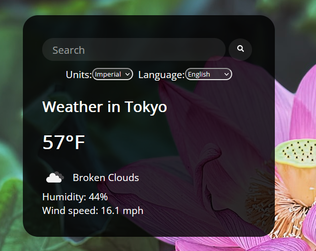

# Weather App
A website that uses a weather API to get the searched city's weather by name.

### Summary: 
Used the <a href="https://openweathermap.org/">OpenWeather</a> API to dynamically get the current weather from popular cities by searching by their names. Utilizing HTML, CSS and JavaScript skills to complete this project.

## Project Status (Complete): ✅

**Minimum requirements:**

    ✅ Searchable weather by city name.

    ✅ Display city name, tempature, humidity and wind speed.

    ✅ Dynamic display, including random background images.

**Extras:**

    ✅ Better error handling if API call fails.

    ✅ Prevent duplicate API calls. 

    ✅ Add the option to change the language. 

    ✅ Add the option to toggle between imperial and metric. 

## 
